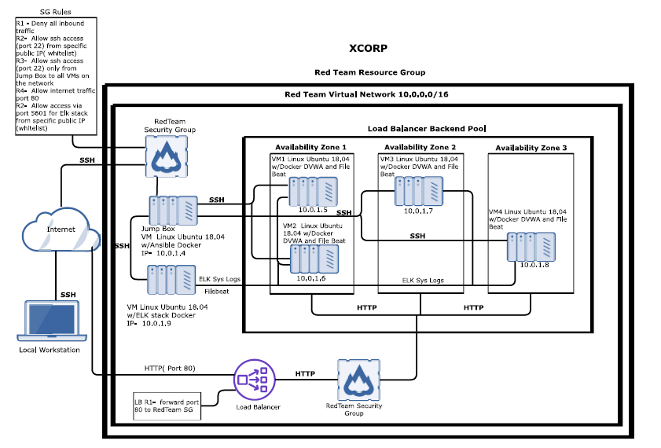
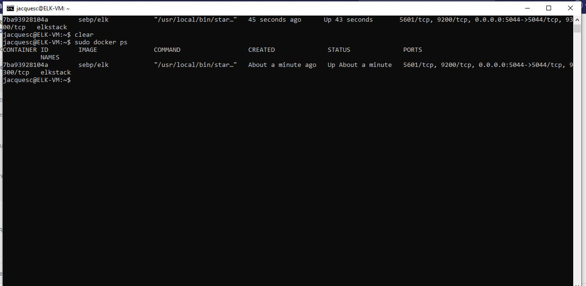

## Automated ELK Stack Deployment

The files in this repository were used to configure the network depicted below.

These files have been tested and used to generate a live ELK deployment on Azure. They can be used to either recreate the entire deployment pictured above. Alternatively, select portions of the configuration file may be used to install only certain pieces of it, such as Filebeat.

   - [filebeat_playbook](ansible/filebeat_playbook.yml)

This document contains the following details:
- Description of the Topology
- Access Policies
- ELK Configuration
  - Beats in Use
  - Machines Being Monitored
- How to Use the Ansible Build

### Description of the Topology

The main purpose of this network is to expose a load-balanced and monitored instance of DVWA, the D*mn Vulnerable Web Application.

Load balancing ensures that the application will be highly available and reliable, in addition to restricting access to the network.
- The off-loading function of a load balancer defends an organization against denial-of-service (DoS) attacks. 
- As shown in the diagram, the jump box is essentially identical to a gateway router (single node; fanning in); the advantage of that design is that sits in front of other machines (DVWAs and the ELK) that are not exposed to the public internet. It controls access to the other machines by allowing connections from specific IP addresses and forwarding to those machines.

Integrating an ELK server allows users to easily monitor the vulnerable VMs for changes to the file system and system logs.
- Filebeat collects data about the file system including when and which files have changed. It is used in this project to monitor the Apache server and MySQL database logs generated by DVWA machines.
- Metricbeat collects machine metrics, such as CPU usage, uptime.

The configuration details of each machine may be found below.

| Name     | Function | IP Address | Operating System |
|----------|----------|------------|------------------|
| Jump Box | Gateway  | 10.0.1.4   | Linux            |
| Elk Stack| Monitor  | 10.0.1.9   | Linux            |
| DVWA-VM1 | App & DB | 10.0.1.5   | Linux            |
| DVWA-VM2 | App & DB | 10.0.1.6   | Linux            |
| DVWA-VM3 | App & DB | 10.0.1.7   | Linux            |
| DVWA-VM4 | App & DB | 10.0.1.8   | Linux            |

### Access Policies

The machines on the internal network are not exposed to the public Internet.

Only the Jump Box can accept connections from the Internet. Access to this machine is only allowed from the following IP addresses:
_173.67.243.40_

Machines within the network can only be accessed by the Jump Box.
- _The Elk VM is accessible using Jump Box / ansible docker container. Jump Box public IP address was 51.141.164.178_

A summary of the access policies in place can be found in the table below.

| Name     | Publicly Accessible | Allowed IP Addresses |
|----------|---------------------|----------------------|
| Jump Box | Yes                 | 173.67.243.40        |
| Elk Stack| No                  | 10.0.1.4             |
| DVWA-VM1 | No                  | 10.0.1.4             |
| DVWA-VM2 | No                  | 10.0.1.4             |
| DVWA-VM3 | No                  | 10.0.1.4             |
| DVWA-VM4 | No                  | 10.0.1.4             |

### Elk Configuration

Ansible was used to automate configuration of the ELK machine. No configuration was performed manually, which is advantageous because
configuring The ELK VM require downloading and installing different applications to work together which can be time consuming.
Using Ansible increases productivity and ensures our configurations will do exactly the same thing every time we run them, by eliminating as 
much variability between configurations as possible.

The playbook implements the following tasks:
- Change the memory on the host machine.
- Install docker.io: the Docker engine, used for running containers.
- Install python-pip: used to install Python software.
- Install docker: Python client for Docker. Required by ELK.
- Download the Docker container called sebp/elk
- Configure the container to start with the following port mappings: 5601:5601; 9200:9200; 5044:5044
- Start the container.

The following screenshot displays the result of running `docker ps` after successfully configuring the ELK instance.

### Target Machines & Beats
This ELK server is configured to monitor the following machines:
- _10.0.1.5; 10.0.1.6; 10.0.1.7; 10.0.1.8_

We have installed the following Beats on these machines:
- _Filebeat_

These Beats allow us to collect the following information from each machine:
- _Filebeat monitors the system log files, collects log events such auth.log which tracks usage of authorization or logon events._

### Using the Playbook
In order to use the playbook, you will need to have an Ansible control node already configured. Assuming you have such a control node provisioned: 

SSH into the control node and follow the steps below:
- Copy the filebeat-playbook.yml file to /etc/ansible/roles/.  Ensure the filebeat configaration file (filebeat_configuration.yml) is added to /etc/ansible/files/.
- Update the ansible hosts file to include the IP of the machines. For Elk add a group called [elkservers] on the ansible hosts file and specify the IP address of the ELK VM.
- Use the hosts option in Ansible to specify which machines to install elk on and which one to install filebeat i.e. for elk use elkservers and for filebeat use webservers.
- Run the playbook, and navigate to http://[Elk.VM.IP]:5601 to check that the installation worked as expected.

- Which file is the playbook? filebeat_playbook.yml 
- Where do you copy it? /etc/ansible/roles/
- Which file do you update to make Ansible run the playbook on a specific machine? ansible hosts file
- How do I specify which machine to install the ELK server on versus which to install Filebeat on? 
    - For Elk add a group called [elkservers] on the ansible hosts file and specify the IP address of the ELK VM.
    - Use the hosts option in Ansible to specify which machines to install elk and which one to install filebeat i.e. for elk use elkservers and for filebeat use webservers.

- Which URL do you navigate to in order to check that the ELK server is running? Navigate to http://[Elk.VM.IP (52.175.218.194)]:5601. 
